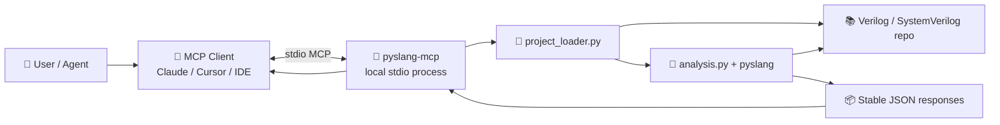
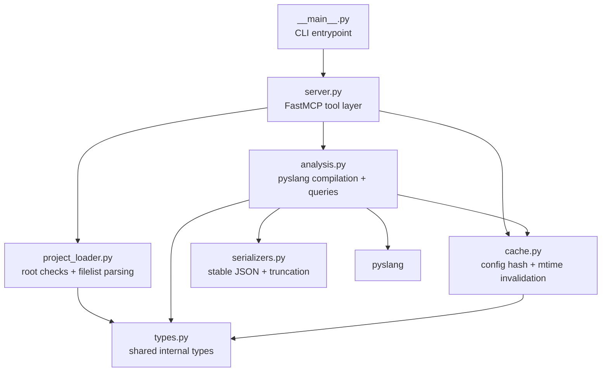
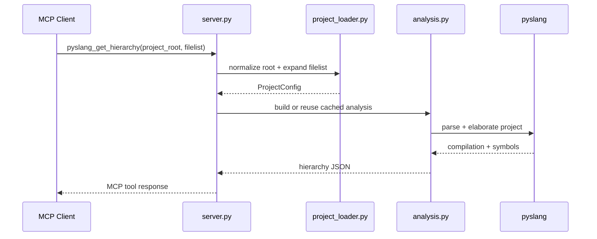
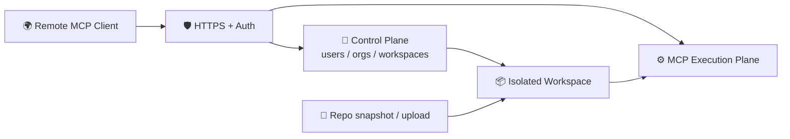

# pyslang-mcp

[](https://github.com/asicdesign-ai/pyslang-mcp/actions/workflows/ci.yml)


`pyslang-mcp` is an alpha-quality, local-first Model Context Protocol server
for read-only, compiler-backed analysis of Verilog and SystemVerilog projects
using [`pyslang`](https://pypi.org/project/pyslang/).

The goal is narrow and explicit: give AI clients structured HDL project context
through real parsing and elaboration, not raw text search. This project is a
semantic analysis MCP, not a simulator, synthesizer, waveform viewer, or code
generator.

> [!IMPORTANT]
> This repo now contains a runnable alpha implementation, but it is not yet a
> published or broadly hosted MCP product.

## ✨ Why This Exists

AI coding agents can already search HDL repositories as text. That is useful,
but weak. `pyslang-mcp` exists to answer questions that benefit from a real
compiler frontend:

- What design units exist?
- What diagnostics were produced?
- How do modules instantiate each other?
- Where is a symbol declared or referenced?
- How did a filelist, include path, or define actually resolve?

## 🚦 Status

As of 2026-04-19, the repository contains:

- `pyproject.toml` packaging metadata
- a `FastMCP` server under `src/pyslang_mcp/`
- a `stdio` entrypoint via `python -m pyslang_mcp`
- fixture-backed tests for loader, analysis, and MCP `call_tool()` paths
- an Ubuntu GitHub Actions CI workflow

What is still not done:

- no PyPI release yet
- no MCP Registry publication yet
- no publish automation yet
- no claim of frozen long-term schemas yet
- no promise of full standalone preprocessor fidelity

## 🧰 Implemented Tools

The current alpha implements these read-only tools:

| Area | Tools |
|---|---|
| Parse / load | `pyslang_parse_files`, `pyslang_parse_filelist` |
| Diagnostics | `pyslang_get_diagnostics` |
| Semantic inventory | `pyslang_list_design_units`, `pyslang_describe_design_unit` |
| Structure | `pyslang_get_hierarchy`, `pyslang_get_project_summary` |
| Lookup | `pyslang_find_symbol` |
| Syntax / preprocessing summaries | `pyslang_dump_syntax_tree_summary`, `pyslang_preprocess_files` |

## 🔒 Guardrails

- strict project-root scoping; paths outside the declared root are rejected
- `stdio` transport first
- compact JSON responses instead of giant raw compiler dumps
- in-memory caching keyed by normalized project config plus tracked file mtimes
- conservative `pyslang_preprocess_files` behavior that returns preprocessing metadata
  and excerpts, not a claimed full preprocessed text stream

## 🗂️ Current Filelist Support

The implemented `.f` parser intentionally supports a practical subset:

- raw source file entries
- nested filelists with `-f` and `-F`
- include directories with `+incdir+...` and `-I`
- macro defines with `+define+...`

Unsupported directives are reported back in `pyslang_parse_filelist` output instead of
being silently ignored.

## 🧪 HDL Example Corpus

The repo now includes a generated HDL corpus under
[`examples/hdl`](./examples/hdl/) with:

- clean reference designs from single modules up to small-IP projects
- intentionally buggy duplicates labeled `easy`, `medium`, and `hard`
- local validation against both `pyslang` and Verilator

Run the full corpus validator locally:

```bash
./.venv/bin/python scripts/validate_hdl_examples.py
```

CI only runs a small smoke subset so the repository keeps representative HDL
coverage without turning the example corpus into the product.

## 🏃 Quickstart

Local development setup:

```bash
cd /path/to/pyslang-mcp
python -m venv .venv
./.venv/bin/pip install -e '.[dev]'
```

Run the editable install from the repository root. If you start in a fresh
terminal elsewhere, `cd` into the clone first so `pip` resolves the local
`pyproject.toml`.

Run the server over `stdio`:

```bash
./.venv/bin/python -m pyslang_mcp
```

Or choose a transport explicitly:

```bash
./.venv/bin/python -m pyslang_mcp --transport stdio
```

## 🧭 Local Client Setup

Today, the intended connection model is local `stdio`.

That means:

- the MCP server process runs on the same machine, VM, or dev container that
  contains the HDL checkout
- the MCP client launches `pyslang-mcp` as a child process
- tool calls use `project_root` paths that exist on that same filesystem

This is the same basic pattern used by many local MCP integrations, even when a
vendor also offers hosted connectors for other products.

### Local Operation At A Glance



### Generic `stdio` Client Configuration

Generic local client configuration:

```json
{
  "mcpServers": {
    "pyslang-mcp": {
      "command": "/path/to/python",
      "args": [
        "-m",
        "pyslang_mcp",
        "--transport",
        "stdio"
      ]
    }
  }
}
```

For a local checkout with the repository virtualenv, that usually means:

```json
{
  "mcpServers": {
    "pyslang-mcp": {
      "command": "/absolute/path/to/pyslang-mcp/.venv/bin/python",
      "args": [
        "-m",
        "pyslang_mcp",
        "--transport",
        "stdio"
      ]
    }
  }
}
```

### Client Examples

#### Claude Desktop

Add a local MCP server entry that points at the repository virtualenv:

```json
{
  "mcpServers": {
    "pyslang-mcp": {
      "command": "/absolute/path/to/pyslang-mcp/.venv/bin/python",
      "args": ["-m", "pyslang_mcp", "--transport", "stdio"]
    }
  }
}
```

#### Cursor

Use the same command/args pattern in Cursor's MCP configuration:

```json
{
  "mcpServers": {
    "pyslang-mcp": {
      "command": "/absolute/path/to/pyslang-mcp/.venv/bin/python",
      "args": ["-m", "pyslang_mcp", "--transport", "stdio"]
    }
  }
}
```

#### Generic IDE / Agent Runner

Any MCP client that supports local child-process servers can use:

```json
{
  "mcpServers": {
    "pyslang-mcp": {
      "command": "/absolute/path/to/pyslang-mcp/.venv/bin/python",
      "args": ["-m", "pyslang_mcp", "--transport", "stdio"]
    }
  }
}
```

### Local Install Options

Development checkout:

```bash
git clone https://github.com/asicdesign-ai/pyslang-mcp.git
cd pyslang-mcp
python -m venv .venv
./.venv/bin/pip install -e '.[dev]'
```

Then point the MCP client at:

- `command`: `/absolute/path/to/pyslang-mcp/.venv/bin/python`
- `args`: `["-m", "pyslang_mcp", "--transport", "stdio"]`

Future packaged install target:

```bash
pip install pyslang-mcp
```

Then point the MCP client at either:

- `command`: `pyslang-mcp`
- `args`: `[]`

or:

- `command`: `python`
- `args`: `["-m", "pyslang_mcp"]`

### Tool Input Rules

- Always provide `project_root`.
- Provide exactly one of `files` or `filelist`.
- Paths may be relative to `project_root` or absolute, but they must remain
  inside `project_root`.
- `include_dirs`, `defines`, and `top_modules` are optional.

Example `pyslang_parse_files` payload:

```json
{
  "project_root": "/path/to/rtl-project",
  "files": [
    "rtl/pkg.sv",
    "rtl/top.sv"
  ],
  "include_dirs": [
    "include"
  ],
  "defines": {
    "WIDTH": "32"
  },
  "top_modules": [
    "top"
  ]
}
```

Example `pyslang_parse_filelist` payload:

```json
{
  "project_root": "/path/to/rtl-project",
  "filelist": "compile/project.f"
}
```

Example `pyslang_find_symbol` payload:

```json
{
  "project_root": "/path/to/rtl-project",
  "filelist": "compile/project.f",
  "query": "payload",
  "match_mode": "exact",
  "include_references": true
}
```

### Example Prompts

Use this MCP when compiler-backed answers beat text search, or when a question
spans multiple files. These are the prompts where `pyslang_mcp` earns its
elaboration cost.

#### Uniqueness, absence, and cardinality

grep tells you "I found N matches"; the MCP tells you "the elaborator
confirms X." Compiler-backed claims grep cannot make:

- *"Is `ecc_error` actually consumed, or is it dead? I need
  compiler confirmation that every load is an UNCONNECTED sink, not just
  text matches."*
- *"Is module `legacy_widget` instantiated anywhere the elaborator sees,
  even if grep finds its name only in comments?"*
- *"For signal `fsm_discard`, how many distinct declarations match that
  exact name across the project?"*

#### Cross-module and hierarchical queries

grep iterates and loses context; the MCP walks the elaborated tree once:

- *"From `top`, walk the instance hierarchy and show me every instance of
  `sync_fifo_mem` with its hierarchical path and port connections."*
- *"Describe module `kuku_top`: ports, child instances, declared
  names."*
- *"List every top-level instance in the elaborated design and report its
  depth."*

#### Project health and diagnostics

- *"Parse `compile/project.f` with `+define+DEBUG` and report every error
  and warning with file/line locations."*
- *"Group the current diagnostics by file so I can triage which modules
  are worst."*
- *"Does this project compile cleanly under pyslang? I want parse plus
  semantic diagnostics, no text-matching."*

#### Structural inventory

- *"List every design unit in the project grouped by kind (module /
  interface / package)."*
- *"Give me the project shape: file count, top instances, diagnostic
  counts, tracked paths. No deep analysis."*

#### Filelist and preprocessing sanity

- *"Run `pyslang_parse_filelist` on `compile/project.f` and confirm the
  resolved file set, include paths, defines, and any unsupported
  directives match what my simulator uses."*

#### Symbol cohort analysis

- *"For module `kuku_top`, list every declared name so I can
  check whether `ecc_err` is part of a cohort of
  UNCONNECTED scalars."*
- *"Where is type `data_t` defined, and what variables or ports declare
  it?"*

### When Not To Reach For This MCP

Be honest — the MCP pays elaboration cost that plain text tools avoid.

**Plain `grep` / `Read` wins:**

- Single-file questions with known locality ("what does line 42 of this
  file do?", "is the string `foo_bar` mentioned anywhere?").
- Comment or docstring lookups ("what's the comment above this
  function?").
- Incomplete file sets — parse errors from unresolved cross-module
  references can silently degrade downstream results (`describe_*` may
  return empty port lists). If the file set you can supply is not
  self-contained, grep plus Read give cleaner answers.

**Direct `pyslang` wins:**

- Bespoke analyses with custom visitors: "count `always_ff` blocks that
  use negedge reset," "build a call graph of tasks inside module X,"
  "run this custom lint rule." Ten lines of pyslang beats composing
  tool calls.
- Expression evaluation in custom scopes, what-if parameter sweeps,
  incremental re-elaboration.

**Out of charter entirely:**

- Rename / refactor / format / autofix — the MCP is strictly read-only.
- Testbench generation, synthesis, simulation, waveform analysis.

### Recommended Workflow

1. Start with `pyslang_parse_filelist` or `pyslang_parse_files` to confirm the
   project root,
   file expansion, include dirs, and defines are what you expect.
2. Run `pyslang_get_diagnostics` to see parse or semantic issues early.
3. Use `pyslang_list_design_units` and `pyslang_describe_design_unit` to
   understand modules and packages.
4. Use `pyslang_get_hierarchy` to inspect instantiation structure.
5. Use `pyslang_find_symbol` for declaration and reference lookup.
6. Use `pyslang_dump_syntax_tree_summary` and `pyslang_preprocess_files` only
   when you need
   syntax or preprocessing context; they are intentionally compact.

### What Clients Should Expect Back

- responses are JSON dictionaries
- large result lists include truncation metadata
- every successful tool response carries `project_status` so clients can tell
  `ok` from `degraded` or `incomplete` analysis
- recoverable input problems return MCP tool errors with structured error payloads
- `pyslang_describe_design_unit` returns `found` / `ambiguous` results instead
  of throwing for normal lookup misses
- `pyslang_preprocess_files` is summary-oriented; it does not claim to
  reproduce a full
  standalone preprocessed output stream
- if a path escapes the declared root, the tool returns an error instead of reading it

## 🏗️ Architecture

The implementation is intentionally split into a small analysis core with a thin
MCP wrapper.



### Typical Tool Call Flow



## 🌐 Remote Deployment Direction

If the goal is to make `pyslang-mcp` feel more like well-known connectable MCPs
such as GitHub or Google Sheets, treat hosted access as a separate deployment
product surface, not as an extension of the current local `stdio` mode.

Current state:

- local-first `stdio` server is implemented
- hosted multi-user deployment is not implemented yet

Recommended hosted direction:

- add a secure HTTP MCP transport
- require authenticated workspaces
- isolate every user or repo workspace
- only analyze files that are present inside the provisioned workspace
- keep the same read-only tool semantics

### Hosted Direction Diagram



See [`REMOTE_DEPLOYMENT.md`](./REMOTE_DEPLOYMENT.md) for the hosted
architecture, security model, and rollout plan.

## 🧪 Development Commands

```bash
./.venv/bin/ruff format src tests
./.venv/bin/ruff check src tests
./.venv/bin/pyright
./.venv/bin/pytest --cov=src/pyslang_mcp --cov-report=term-missing:skip-covered -q
```

## ⚠️ Known Limitations

- `pyslang_preprocess_files` is summary-oriented and intentionally conservative
- `pyslang_find_symbol` currently re-walks the elaborated design per query; it is useful today but not yet indexed for larger corpora
- the filelist parser is a useful subset, not full simulator compatibility
- tool outputs are designed to be stable and compact, but they are still alpha
- packaging and registry publishing are still pending

## 🗺️ Roadmap

- `M0`: research spike and `pyslang` API validation
- `M1`: repo scaffold and local runnable server
- `M2`: parsing, filelists, preprocessing, diagnostics
- `M3`: design-unit listing, hierarchy, symbol lookup
- `M4`: hardening, caching, schema freeze, docs
- `M5`: PyPI release, registry publish, announcement

The repository is now through `M3` in local implementation terms, but release
and publication work is still outstanding.

## 📚 References

- `pyslang`: <https://pypi.org/project/pyslang/>
- `slang`: <https://github.com/MikePopoloski/slang>
- Python MCP SDK: <https://github.com/modelcontextprotocol/python-sdk>
- MCP Registry: <https://github.com/modelcontextprotocol/registry>

## 📄 License

This repository is licensed under the Apache 2.0 terms in
[`LICENSE`](./LICENSE).
